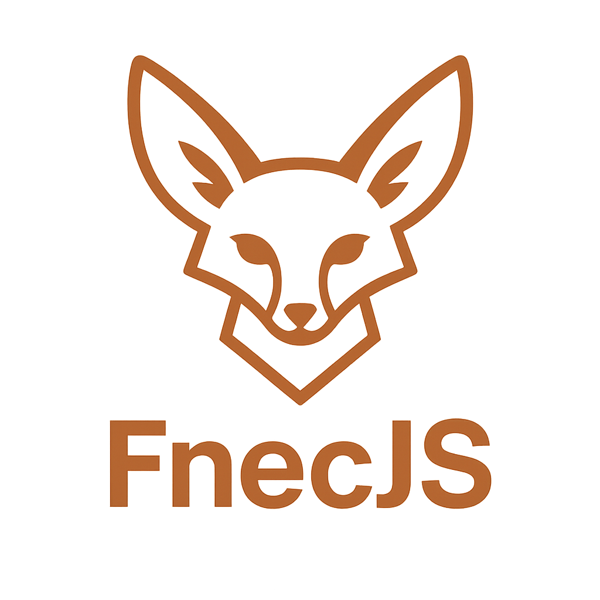

<a name="top"></a>
<div align="center">


**fnecJs** is a lightweight front-end library inspired by [React](https://reactjs.org/) and powered by a modern main/background thread architecture inspired by [lynxJs](https://lynxjs.org/). It's designed for modularity, speed, and clarity — with a structure that scales through a multi-package monorepo.

The name comes from the **fennec**, a small North African fox known for being agile, efficient, and extremely adaptable — just like this library aims to be.

---

## 🔧 Monorepo Structure

This project is organized as a monorepo using [npm workspaces](https://docs.npmjs.com/cli/v9/using-npm/workspaces) (or your preferred monorepo tool). Each major part of the library lives in its own package.

### 📦 Packages

| Package | Description |
|--------|-------------|
| [`fnec`](./FnecJS/packages/fnec/readme.md) | Core exports of the library — includes hooks like `useState`, and the main `render` method. |
| [`fnec-renderer`](./FnecJS/packages/fnec-renderer) | Takes transpiled JSX and transforms it into DOM elements, attaching to the root node. |
| [`fnec-transpiler`](./FnecJS/packages/fnec-transpiler) | Custom JSX transpiler that converts JSX syntax into `fnec`-ready code. |
| [`fnec-shared`](./FnecJS/packages/fnec-shared) | Shared utilities, constants, and types used across all packages. |
| [`fnec-scheduler`](./FnecJS/packages/fnec-scheduler) | Cooperative task scheduler powering FnecJS — handles task queues, priorities, and yielding control to the host. |

Each package has its own README with more detailed documentation and usage examples.

## 🚀 Getting Started

Clone the repo and install dependencies:

```bash
git clone https://github.com/Maokli/FnecJS.git
cd FnecJS
npm install
```

Build all packages:

```bash
npm run build
```

To run tests across all packages:

```bash
npm test
```

---

## 📚 Documentation

You can learn more about each part of the library by diving into the individual package READMEs:

- [`fnec`](./FnecJS/packages/fnec/README.md)
- [`fnec-renderer`](./FnecJS/packages/fnec-renderer/README.md)
- [`fnec-transpiler`](./FnecJS/packages/fnec-transpiler/README.md)
- [`fnec-shared`](./FnecJS/packages/fnec-shared/README.md)
- [`fnec-scheduler`](./FnecJS/packages/fnec-scheduler/README.md)

---

## 🌐 Architecture Highlights

- **Threaded UI model:** Inspired by lynxJs, separating main thread (UI) from background logic for better responsiveness.
- **Custom JSX transpilation:** Tailored for the fnec runtime, keeping the bundle small and fast.
- **Hooks & Functional Components:** Designed for simplicity and extensibility, with familiar patterns like `useState`.

---

## ✨ Status

This project is under active development and not yet production-ready. Expect breaking changes as we iterate and stabilize the core APIs.

---

## 🤝 Contributing

Pull requests and issues are welcome! If you're interested in contributing, check out the individual package READMEs and open issues tagged with `help wanted`.

---

## 📄 License

MIT — free to use, modify, and distribute.

---

Made with 🦊 in Tunisia 🇹🇳.
